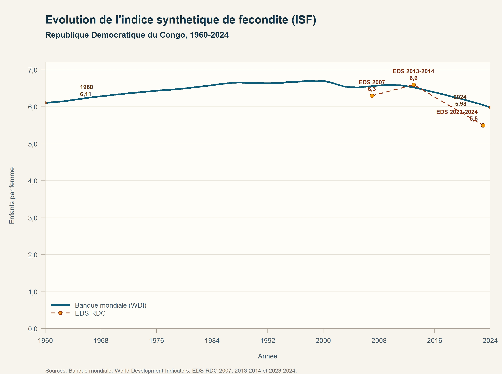
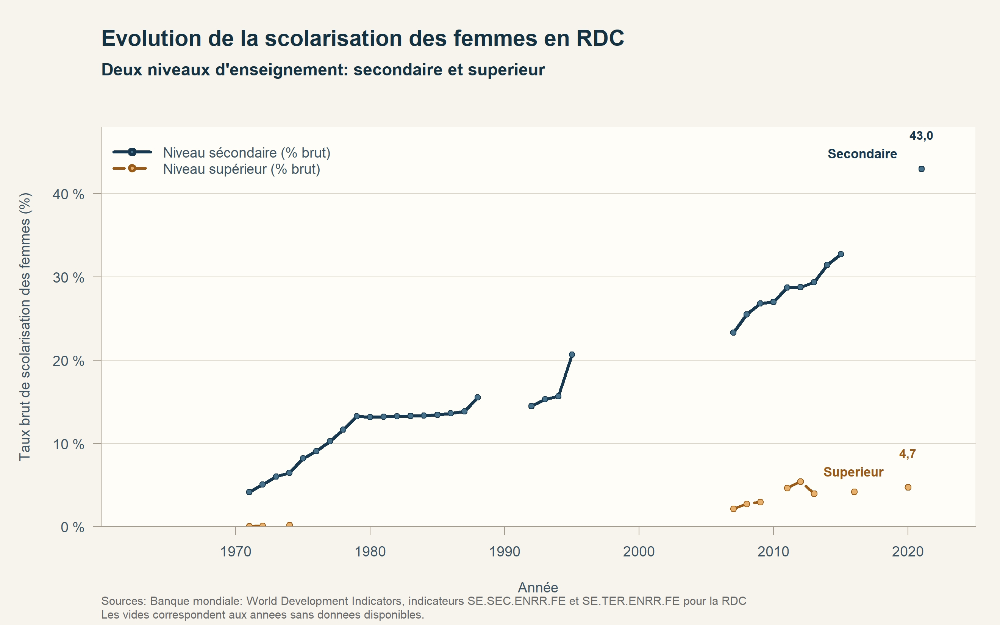
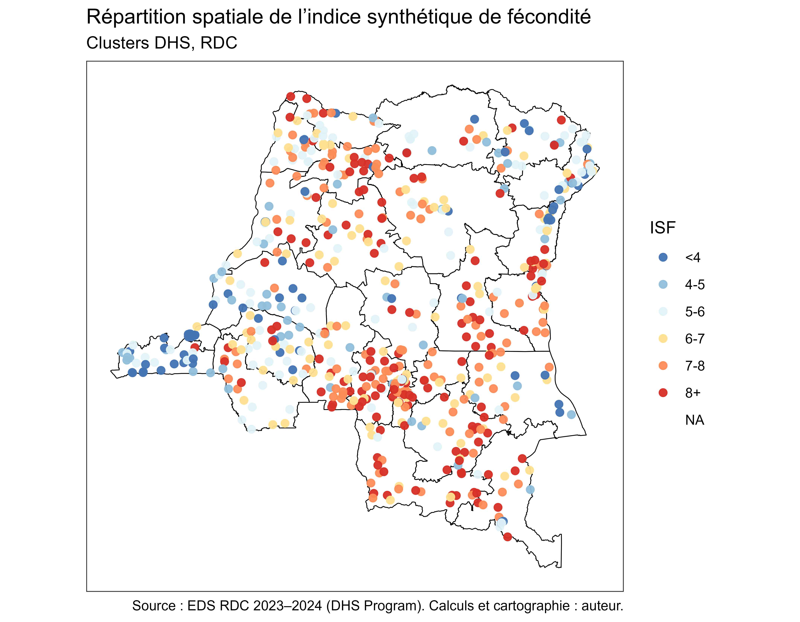
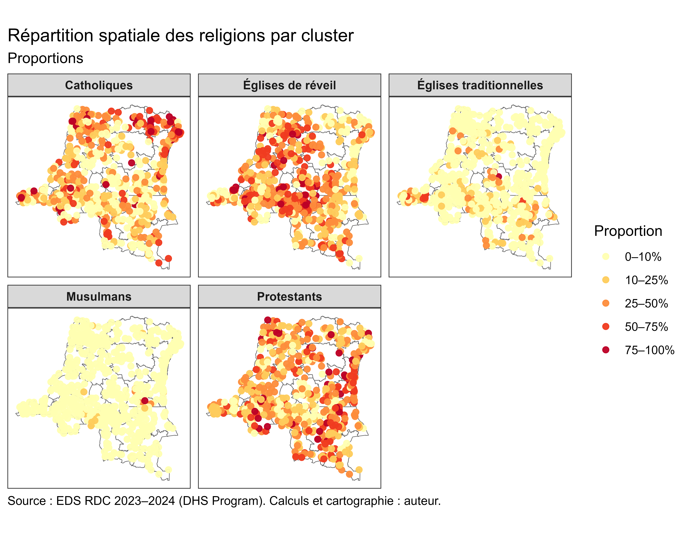
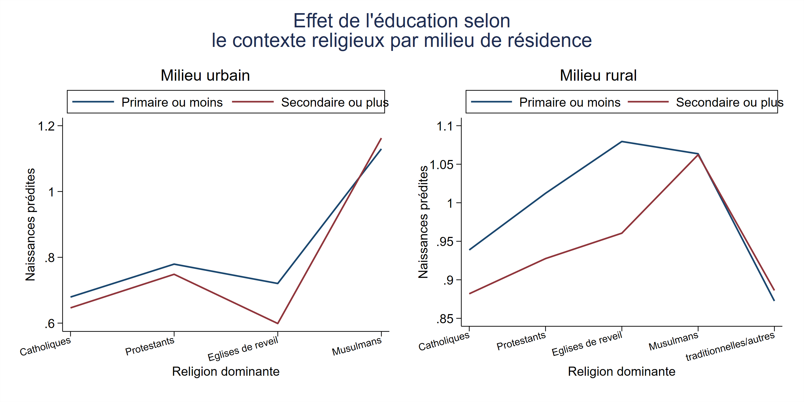

# Multilevel Analysis of Fertility and Community Context in the DRC

**Patrick Ntwali Matabaro · [Gpat95](https://github.com/Gpat95)**

**Stata · R · DHS · Multilevel modelling · Mapping**

## Overview

This project examines whether the association between women’s education and recent fertility varies across local communities and their religious context in the Democratic Republic of the Congo.

The study combines individual and community characteristics from Demographic and Health Survey (DHS) data. The modelled outcome is the number of births during the five years preceding the survey; the descriptive total fertility rate figures provide broader demographic context.

## Methods and workflow

1. Prepare birth and women’s recode files, construct the recent-birth outcome and define survey weights.
2. Build cluster-level measures of religious composition and community context.
3. Estimate multilevel Poisson models with random intercepts, random slopes and cross-level interactions.
4. Examine predictive margins and map spatial variation using R.

These are observational analyses: modelled associations should not be interpreted as established causal effects.

## Figures

Original figures are preserved in their original language. The English captions below describe the supplied outputs; the analyses have not been rerun for this portfolio.

### Figure 1: Total fertility rate over time

*Total fertility rate in the DRC, 1960–2024, comparing the World Bank WDI series with the DHS estimates shown in the original figure. The vertical axis is children per woman.*

### Figure 2: Female school enrolment over time

*Female gross enrolment ratios in secondary and tertiary education in the DRC. Gaps correspond to years without observations in the supplied series; these are enrolment ratios, not educational attainment shares.*

### Figure 3: Religious affiliation among surveyed women

*Religious affiliation among surveyed women in the DRC DHS. Percentages use survey weights; the original figure also reports counts. Categories include Catholic, Protestant, revival churches, Muslim, and traditional or other affiliations.*

### Figure 4: Spatial distribution of total fertility rates

*Cluster-level total fertility rate categories in the DRC DHS 2023–2024. Colours represent children per woman; NA identifies missing values in the original legend.*

### Figure 5: Religious composition across DHS clusters

*Spatial distribution of religious affiliation shares across DHS clusters, with separate panels for Catholic, revival, traditional, Muslim and Protestant groups. Colours represent within-cluster proportions.*

### Figure 6: Spatial variation in the modelled education association

*Predicted incidence rate ratios associated with education across DHS clusters. Values below and above one indicate different directions of the modelled association; the map is not a map of statistical significance or a causal effect.*

### Figure 7: Predicted births by education, religious context and residence

*Predicted numbers of births by education and dominant community religion, shown separately for urban and rural residence. Blue represents primary education or less; red represents secondary education or higher. The two panels use different vertical scales.*

## Available files

| File | Contents |
|---|---|
| [01 — Data preparation](01_data_preparation.do) | Construct the birth outcome, merge records and prepare selected individual variables. |
| [02 — Community context](02_cluster_context.do) | Construct measures of cluster religious composition. |
| [03 — Multilevel models](03_multilevel_models.do) | Estimate Poisson models, interactions and predictive margins. |
| [Religious context and fertility maps](Descriptifs_cartes_Religion%26fecondit%C3%A9.R) | Descriptive mapping under R. |
| [Spatial variation in education associations](Descritives_cartes_Pente%20de%20l%27education.R) | Map cluster-level model outputs. |
| [Defence presentation — PDF](Presentation_Jun2026.pdf) | Original presentation of the research question, methods and findings. |
| [Complete figure gallery](GALLERY.md) | Seven original figures with English captions. |

## Data and reproducibility

DHS microdata and geographic inputs are not included. The numbered Stata files are curated portfolio scripts; they are not yet a self-contained pipeline. The first script expects `birth_recode.dta` and `individual_recode.dta`. Later scripts use prepared variables such as `age`, `cluster`, `religion` and `urban`; their mapping to DHS fields must be checked before execution. The R scripts require geographic data and intermediate tables.

The supplied figures come from the original research workflow and have not been regenerated from the curated scripts.

See [software dependencies](DEPENDANCES.md) for the tools identified in the supplied scripts.

[Back to portfolio](../../README.md) · [Reproducibility notes](../../REPRODUCTIBILITE.md) · [Use and attribution](../../CONDITIONS.md)

