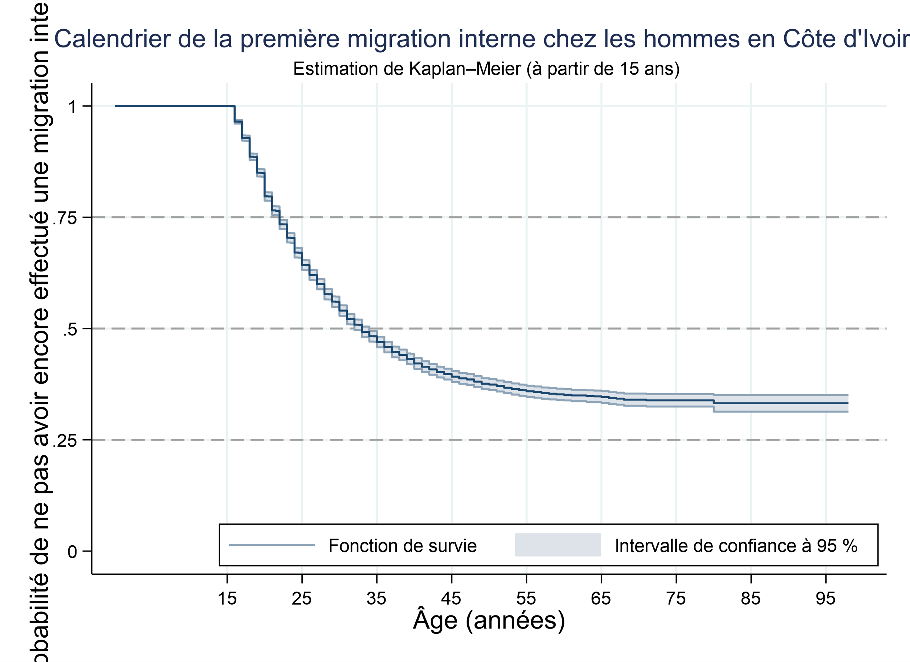
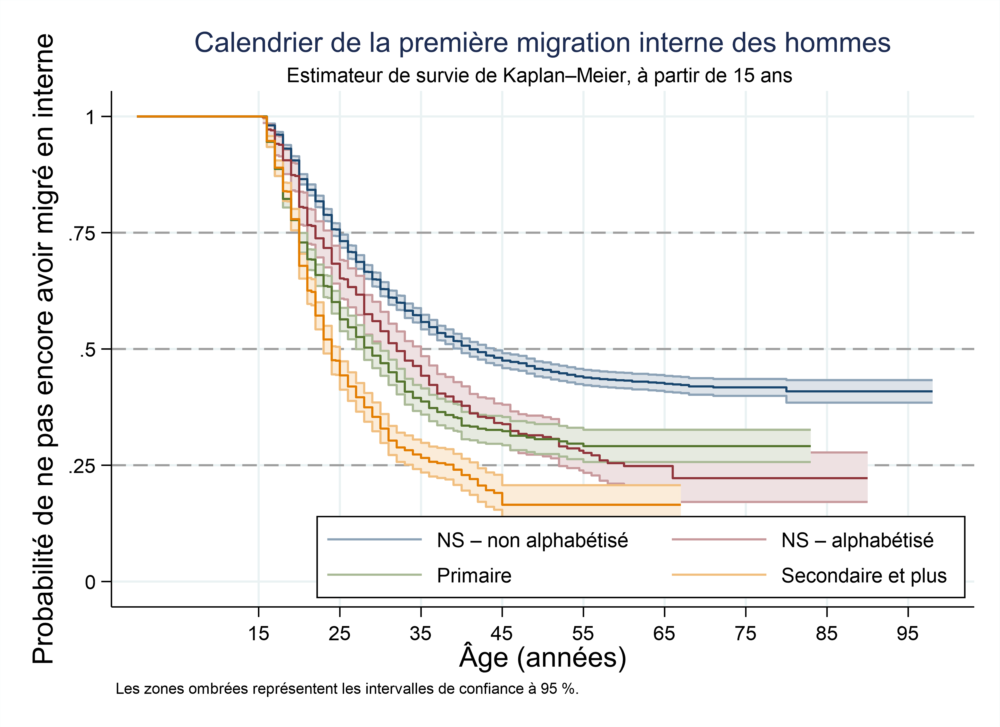
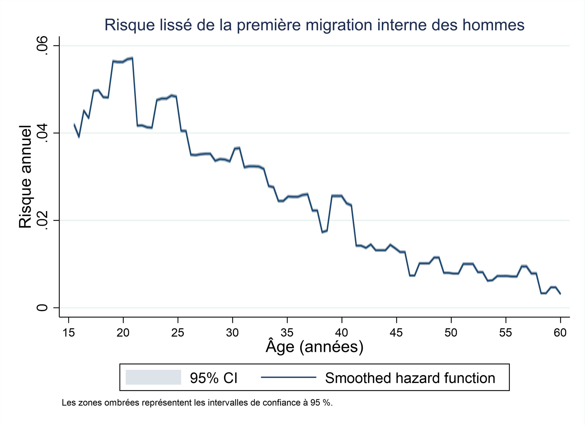
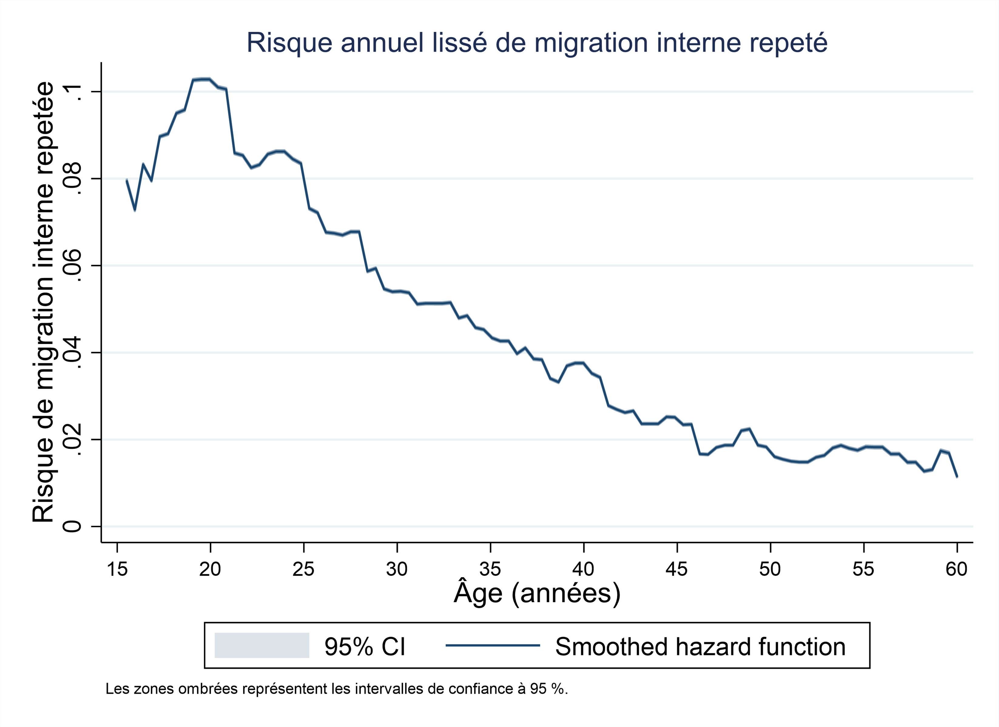
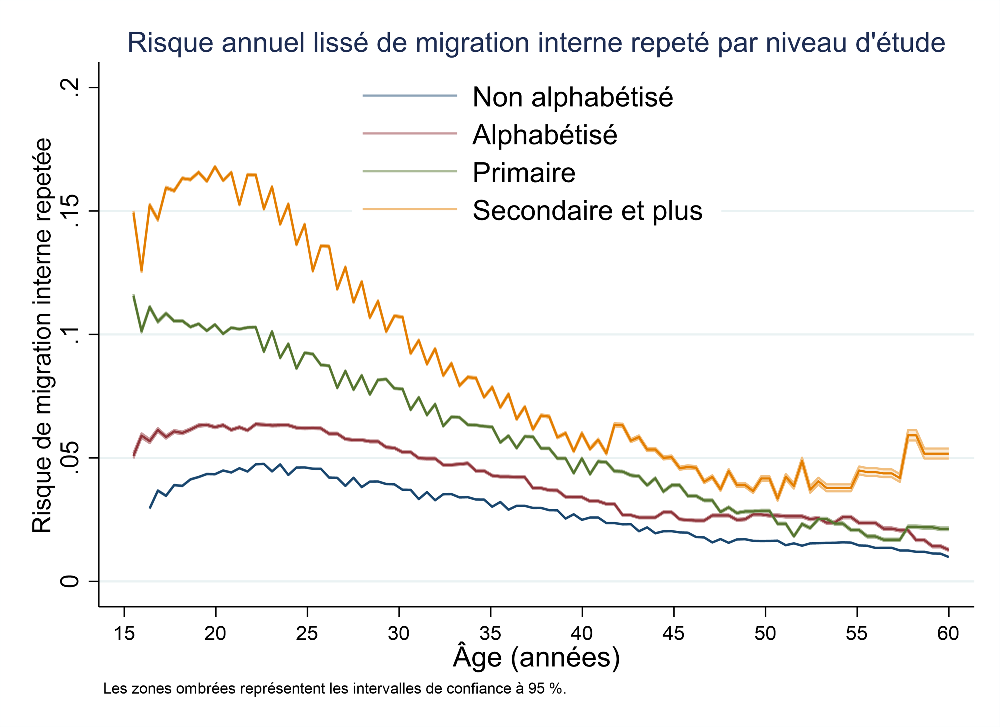
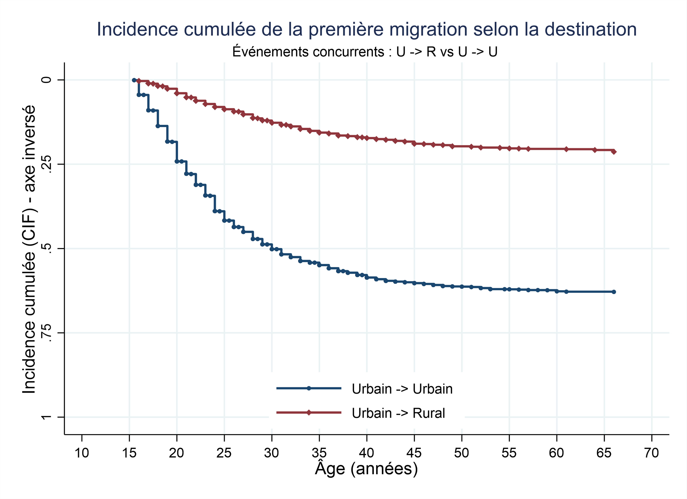
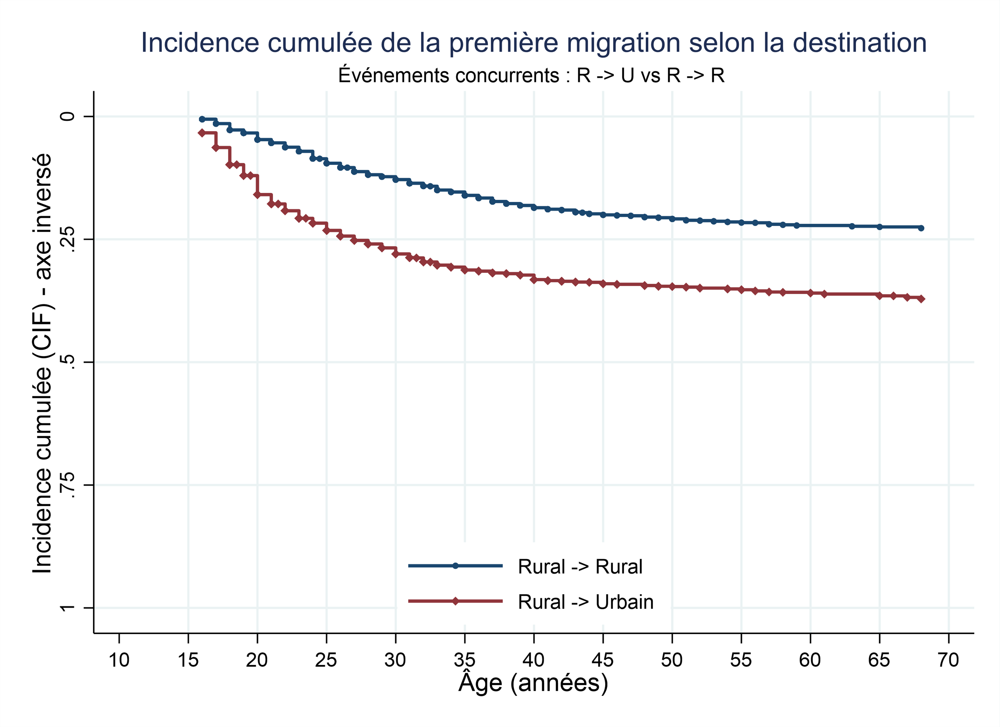
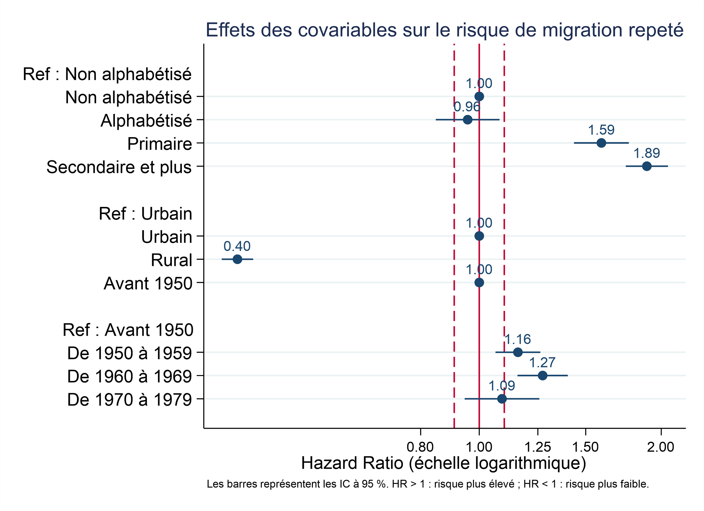
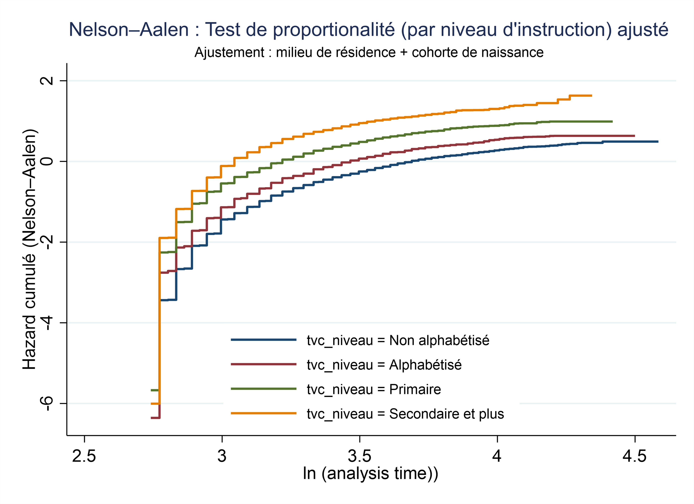

# Internal Migration Dynamics in Côte d’Ivoire

**Patrick Ntwali Matabaro · [Gpat95](https://github.com/Gpat95)**

**Stata · Event-history analysis · Survival models · Competing risks**

## Overview

This project applies event-history methods to longitudinal residential biographies from REMUAO 1993 in Côte d’Ivoire. It examines the timing and determinants of internal migration among men, with particular attention to education, residential context and birth cohorts.

The project distinguishes first migration, repeated migration and competing destinations.

## Methods and workflow

1. Prepare residential episodes, starting dates, birth cohorts and time-varying covariates.
2. Describe first migration using Kaplan–Meier survival estimates and smoothed hazard functions.
3. Fit Cox proportional-hazards models and examine Schoenfeld residual diagnostics.
4. Analyse competing destinations using cumulative incidence functions and Fine–Gray regression.

The figures include outputs from the broader original workflow, including repeated migration. They are not all reproduced by the four curated examples.

## Figures

Original figures are preserved in their original language. The English captions below describe the supplied outputs; the analyses have not been rerun for this portfolio.

### Figure 1: Timing of first internal migration

*Kaplan–Meier estimate of remaining without a first internal migration among men, with follow-up from age 15. The shaded area denotes the original 95% confidence interval. Some text is clipped in the supplied image.*

### Figure 2: First migration by education

*Kaplan–Meier survival curves for first internal migration by education. Categories distinguish no schooling without literacy, no schooling with literacy, primary, and secondary or higher education. Lower survival curves indicate earlier first migration.*

### Figure 3: Age pattern of first migration

*Smoothed hazard of first internal migration by age, with the original 95% confidence band. The hazard describes the age-specific event rate rather than a cumulative probability.*

### Figure 4: Age pattern of repeated migration

*Smoothed hazard of repeated internal migration by age, with the original confidence band.*

### Figure 5: Repeated migration by education

*Smoothed hazards of repeated internal migration by education: non-literate, literate, primary, and secondary or higher. Curves describe associations in the original analysis, not causal effects.*

### Figure 6: Competing destinations from urban areas

*Cumulative incidence of first migration from an urban area to an urban or rural destination. The original vertical axis is reversed: cumulative incidence increases downwards.*

### Figure 7: Competing destinations from rural areas

*Cumulative incidence of first migration from a rural area to a rural or urban destination. The original vertical axis is reversed: cumulative incidence increases downwards.*

### Figure 8: Regression estimates for repeated migration

*Hazard ratios and 95% confidence intervals for education, residence and birth cohort in the repeated-migration model. The horizontal axis is logarithmic; one is the reference value.*

### Figure 9: Graphical proportional-hazards diagnostic

*Adjusted Nelson–Aalen-based diagnostic by education, accounting for residence and birth cohort. The supplied transformed-axis plot is a graphical diagnostic and does not by itself establish that proportional hazards hold.*

## Available files

| File | Contents |
|---|---|
| [01 — Event-history setup](01_event_history_setup.do) | Prepare episode timing and selected covariates. |
| [02 — Survival analysis](02_survival_analysis.do) | Declare survival data and plot Kaplan–Meier curves. |
| [03 — Cox model](03_cox_model.do) | Estimate hazard ratios and inspect proportional-hazards diagnostics. |
| [04 — Competing risks](04_competing_risks.do) | Prepare competing events and estimate a Fine–Gray model. |
| [Original research script](Script.do) | Broader exploratory workflow, retained in its original language. |
| [Research report — PDF](Rapport_Event_story_Analysis.pdf) | Original report with methods, results and limitations. |
| [Complete figure gallery](GALLERY.md) | Nine figures with English captions. |

## Data and reproducibility

The original microdata are not distributed. The numbered examples use simplified variable names and require a prepared dataset with the expected identifiers, episode dates, weights and covariates. They should not be assumed to run directly on the original file without adaptation. `Script.do` expects the original `menbio_rciH.dta` data and includes file replacement commands.

The analysis describes associations rather than causal effects. The source scripts and figures have not been independently rerun.

See [software dependencies](DEPENDANCES.md) for the tools identified in the supplied scripts.

[Back to portfolio](../../README.md) · [Reproducibility notes](../../REPRODUCTIBILITE.md) · [Use and attribution](../../CONDITIONS.md)

