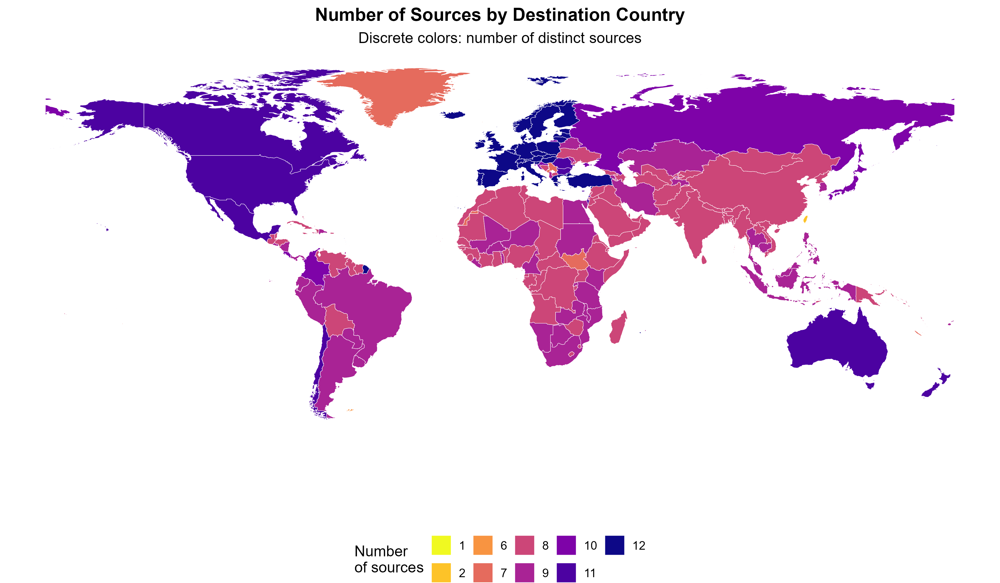
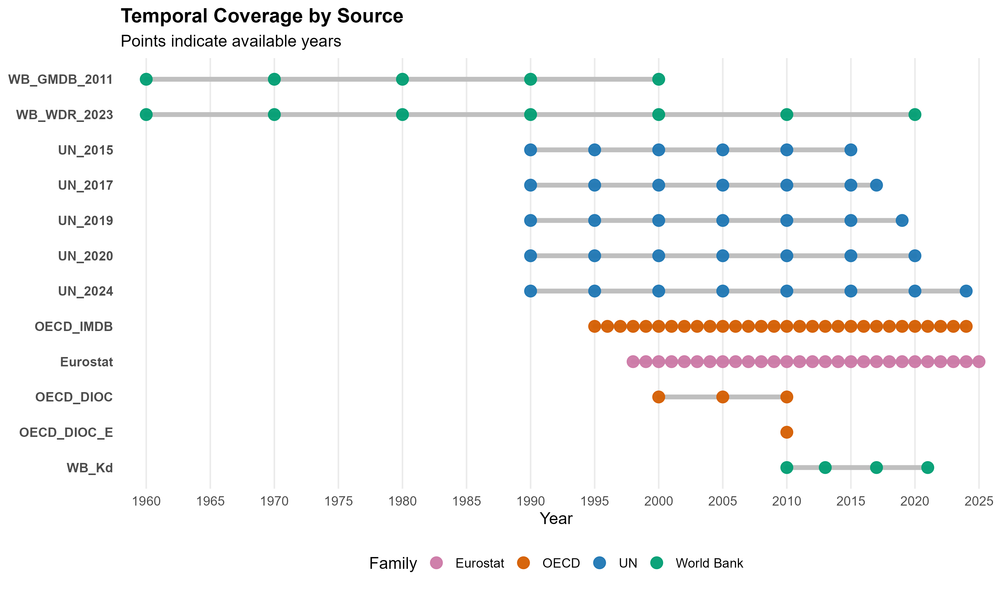

# ABIMS — Data Quality and Anomaly Detection in International Migrant Stocks

**Patrick Ntwali Matabaro · [Gpat95](https://github.com/Gpat95)**

**R · Data validation · Log-GAM · Mapping · Shiny contribution**

## Overview

International migrant-stock databases combine observations from several sources, countries and reference years. Differences in definitions, coverage and reporting practices can produce inconsistent origin–destination series.

This work asks why sources give different estimates for the same origin, destination and year. The portfolio script illustrates coverage analysis and the detection of observations that deviate from a smooth temporal trend.

## My contribution

During my internship at INED in Paris, from April to June 2026, I developed the analytical scripts behind this contribution, produced visualisations and participated in discussions on project direction. My work also covered data-quality checks, enrichment with contextual variables, proposed diagnostic indicators and improvements to an existing R Shiny application.

ABIMS, its consolidated database and its original application are collective work. The public folder currently contains one curated script, rather than the complete set of original scripts. The internship was supervised by Cris Beauchemin, with methodological support from Arnaud Bringé and exchanges with Bruno Schoumaker.

## Methods and workflow

1. Check required columns and prepare the origin–destination data.
2. Fit a Generalized Additive Model (GAM) to `log(value + 10)` for each eligible origin–destination pair, with error handling.
3. Back-transform predictions and compare observations with the fitted trend.
4. Flag observations outside a relative tolerance band combined with an absolute minimum tolerance.
5. Summarise temporal coverage, geographic source coverage and outlier patterns.

The supplied example uses a 10% tolerance and a minimum absolute tolerance of 100. These are diagnostic thresholds, not confidence intervals. A flagged observation requires investigation; it is not automatically a measurement error.

## Figures

Original figures are preserved in their original language. The English captions below describe the supplied outputs; the analyses have not been rerun for this portfolio.

### Figure 1: Geographic coverage of migration sources

*Number of distinct sources by destination country in the supplied ABIMS output. Colours encode source counts, not numbers of migrants; source counts alone do not establish data quality.*

### Figure 2: Temporal coverage of migration sources

*Years represented in each source, grouped into World Bank, UN, OECD and Eurostat families. Points identify available years; connecting segments do not imply observations in every intervening year.*

## Available files

| File | Contents |
|---|---|
| [Portfolio workflow](Script.R) | Curated example covering validation, Log-GAM fitting, tolerance bands and coverage analysis. |
| [Collective project presentation — PDF](EPC_Presentation_260603.pdf) | Original collective presentation; retain the authorship shown in the document. |
| [Complete figure gallery](GALLERY.md) | Geographic and temporal coverage figures. |

## Data and reproducibility

The underlying migration database and complete production workflow are not included. `Script.R` expects an existing `FULL_MIG` object with `from.ISO3c`, `to.ISO3c`, `year`, `value` and `source` columns. The supplied script is a demonstration, not a validated end-to-end reproduction of the original project.

This project concerns migrant stocks. Some identifiers in the supplied demonstration code use the word `flow`; they are retained as original code identifiers and should not be read as a change in the substantive data definition. The original figures are supplied separately and may differ from the plotting choices in the demonstration script. 
See [software dependencies](DEPENDANCES.md) for the tools identified in the supplied scripts.

[Back to portfolio](../../README.md) · [Reproducibility notes](../../REPRODUCTIBILITE.md) · [Use and attribution](../../CONDITIONS.md)

