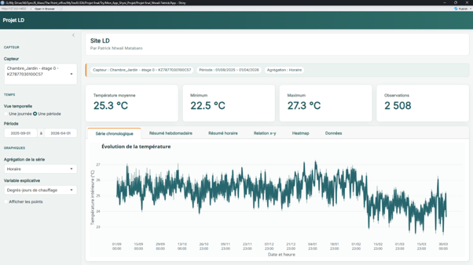

# Thermal and Energy Analysis in Care Homes — Shiny Dashboard

**Patrick Ntwali Matabaro · [Gpat95](https://github.com/Gpat95)**

**R · SQL · Time series · PCA · Regression · Quarto · Shiny**

## Overview

This applied project explores indoor temperatures, weather conditions and energy consumption in a care-home setting. It combines data preparation, exploratory analysis, statistical modelling and an interactive dashboard.

The analytical report covers September 2025 to April 2026. The dashboard supports sensor selection, time filtering and alternative aggregation levels.

## Methods and workflow

1. Import sensor and weather files and retrieve authorised energy data from SQL/MariaDB.
2. Harmonise timestamps, clean records and join the series.
3. Construct daily summaries, hourly profiles and heating-degree indicators.
4. Explore patterns through principal component analysis (PCA), classification and regression diagnostics.
5. Communicate results through a Quarto report, a Shiny/Plotly dashboard and presentation slides.

Energy interpretations depend on the assumptions and diagnostics of the fitted models. The supplied application uses a local data file; it is not a public live-monitoring service.

## Selected figures

Original figures are preserved in their original language. The English captions below describe the supplied outputs; the analyses have not been rerun for this portfolio.

*Original dashboard screenshot: sensor and date filters, summary temperature indicators and an interactive time-series view. The interface is preserved in its original language.*

## Available files

| File | Contents |
|---|---|
| [Analysis report and code](Projet_script%20-MD.qmd) | Original Quarto workflow from data preparation to modelling. |
| [Shiny application](app.R) | Dashboard interface, summaries and interactive plots. |
| [Presentation slides](Projet_MD_Patrick.pptx) | Original presentation of the project. |
| [Dashboard screenshot](Dashoboard.png) | Static preview of the application. |

## Data and reproducibility

Source data and database credentials are not included. The Quarto analysis expects `LD.csv`, `synopuccle.csv` and authorised access to the SQL table `gas`. Database configuration uses the `LD_DB_USER`, `LD_DB_HOST`, `LD_DB_PASSWORD` and `LD_DB_NAME` environment variables.

The application expects `LD_BD.Rda`, containing the `LD_BD` object, beside `app.R`. Once authorised data and dependencies are available, run `shiny::runApp(".")` from this project folder. The report also requires Quarto. Although the report and slides have been renamed with the `MD` prefix, the supplied code still uses `LD` data and object names; these must remain consistent when running it.

The application and analyses have not been rerun for this documentation update.

See [software dependencies](DEPENDANCES.md) for the tools identified in the supplied scripts.

[Back to portfolio](../../README.md) · [Reproducibility notes](../../REPRODUCTIBILITE.md) · [Use and attribution](../../CONDITIONS.md)
